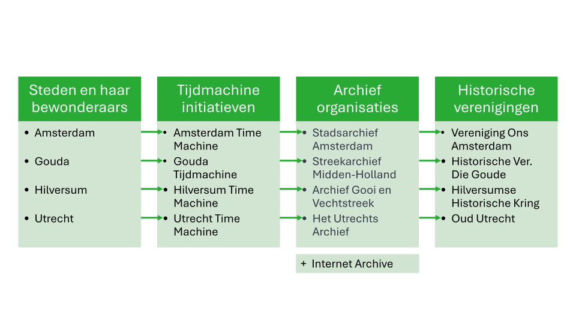
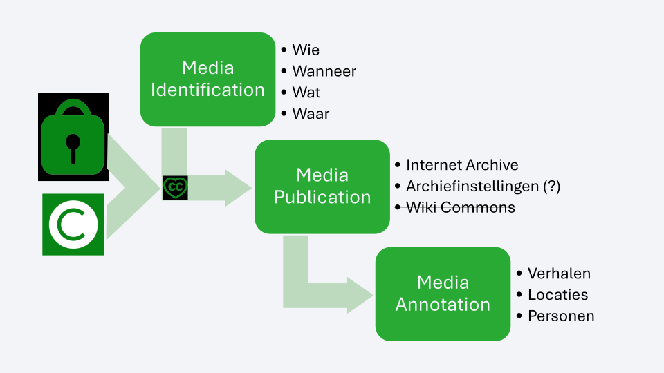
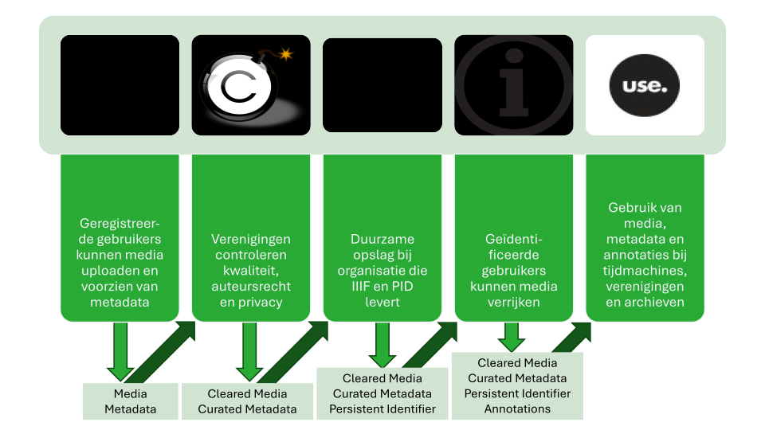
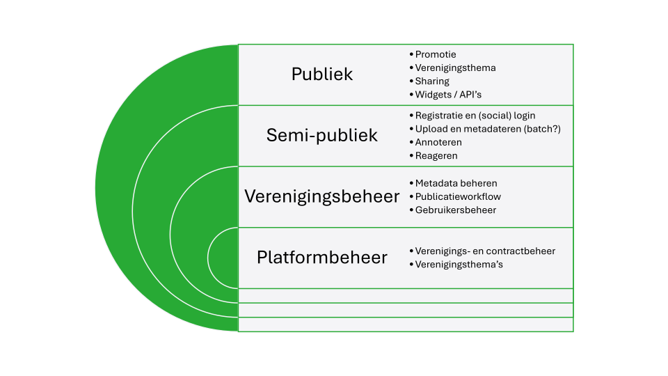
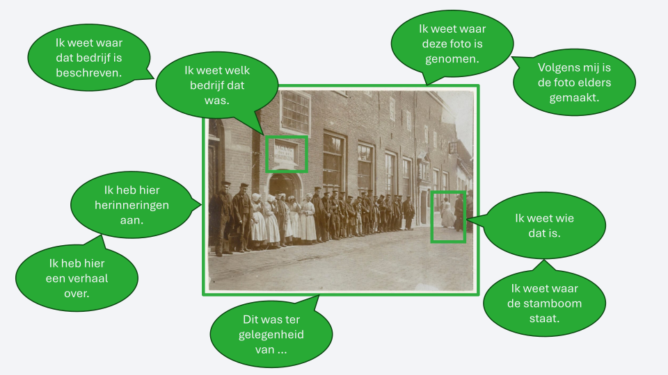
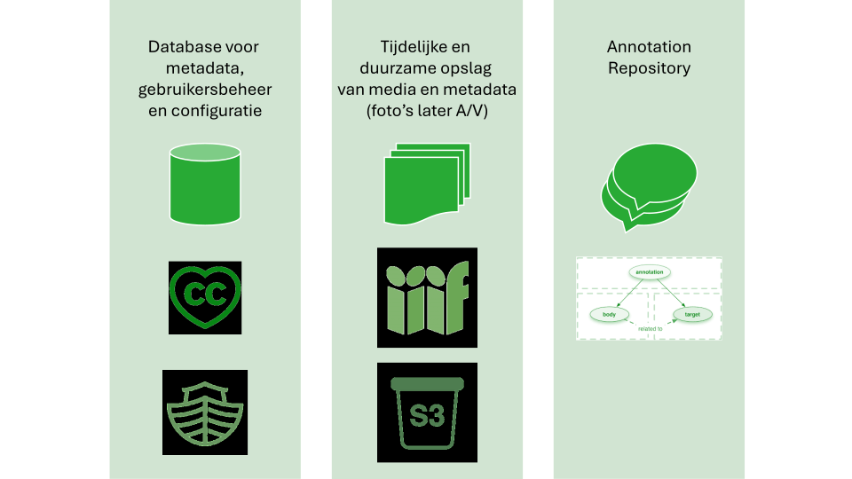

# Praatplaten # {#praatplaten}

<h3 id="praatplaat-stakeholders">Stakeholders</h3>

<h3 id="praatplaat-media-process">Media process</h3>

<h3 id="praatplaat-process-steps">Process steps</h3>

<h3 id="praatplaat-platform-parts"> Platform parts</h3>

<h3 id="praatplaat-annotations">Annotations</h3>

<h3 id="praatplaat-technology-parts">Technology part</h3>

