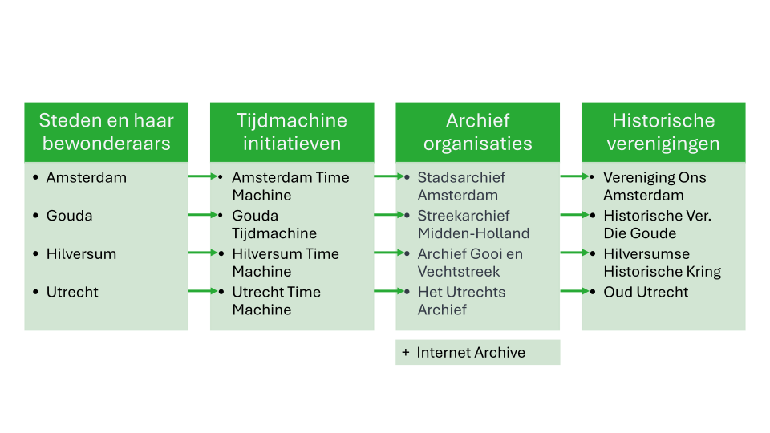
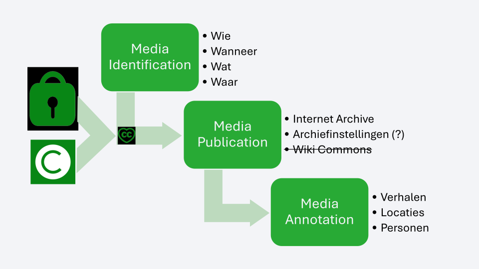
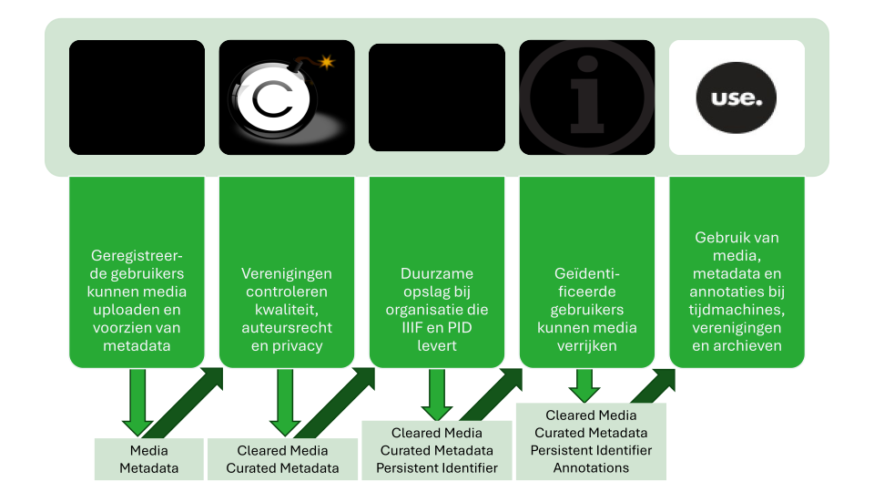
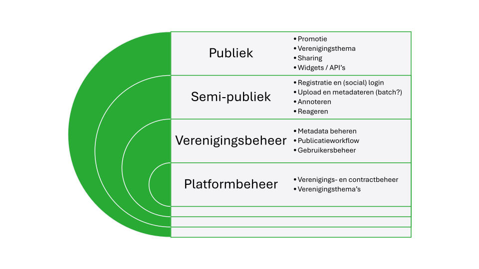
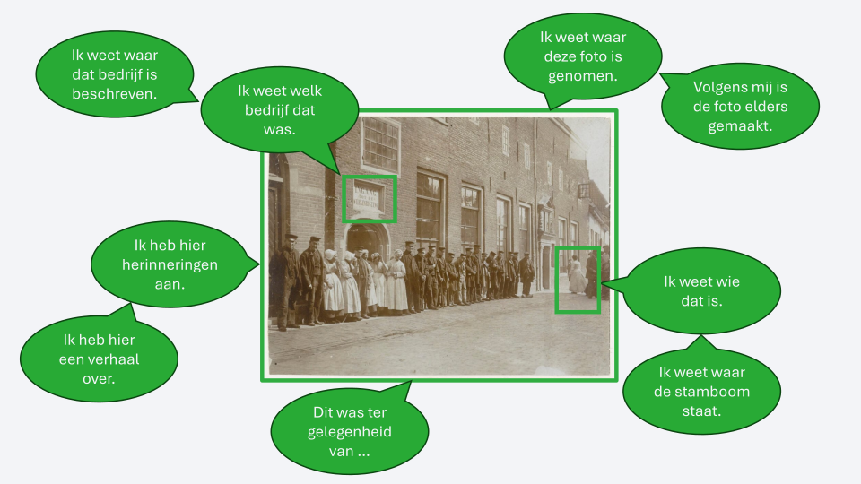
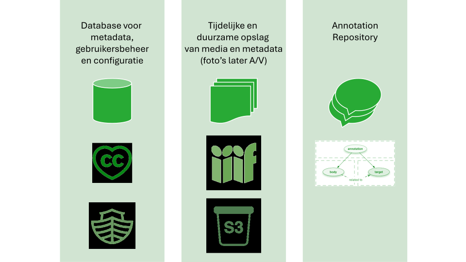

# Praatplaten # {#praatplaten}

<h3 id="praatplaat-stakeholders">Belanghebbenden</h3>

<h3 id="praatplaat-media-process">Mediaproces</h3>

<h3 id="praatplaat-process-steps">Processtappen</h3>

<h3 id="praatplaat-platform-parts"> Platformonderdelen</h3>

<h3 id="praatplaat-annotations">Annotaties</h3>

<h3 id="praatplaat-technology-parts">Technische onderdelen</h3>

