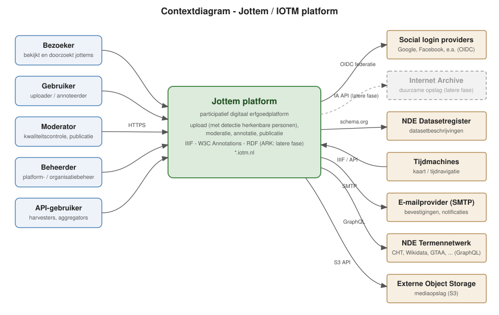

# Systeemarchitectuur

De [systeemarchitectuur](systeemarchitectuur/architectuur.html) van Jottem beschrijft een op Docker gebaseerde systeemarchitectuur voor het Jottem-platform: een participatief digitaal erfgoedplatform waarin gebruikers media (jottems) uploaden, moderatoren deze beoordelen en publiceren, en annoteerders verrijkingen toevoegen. Het geheel wordt via subdomeinen onder iotm.nl ontsloten en implementeert de in het designdocument genoemde standaarden: IIIF Image API 3.0, IIIF Presentation API 3.0, IIIF Change Discovery, W3C Web Annotations, schema.org AP NDE, ARK en RSS.

*(klik op bovenstaand contextdiagram voor het gehele architectuurdocument)*
